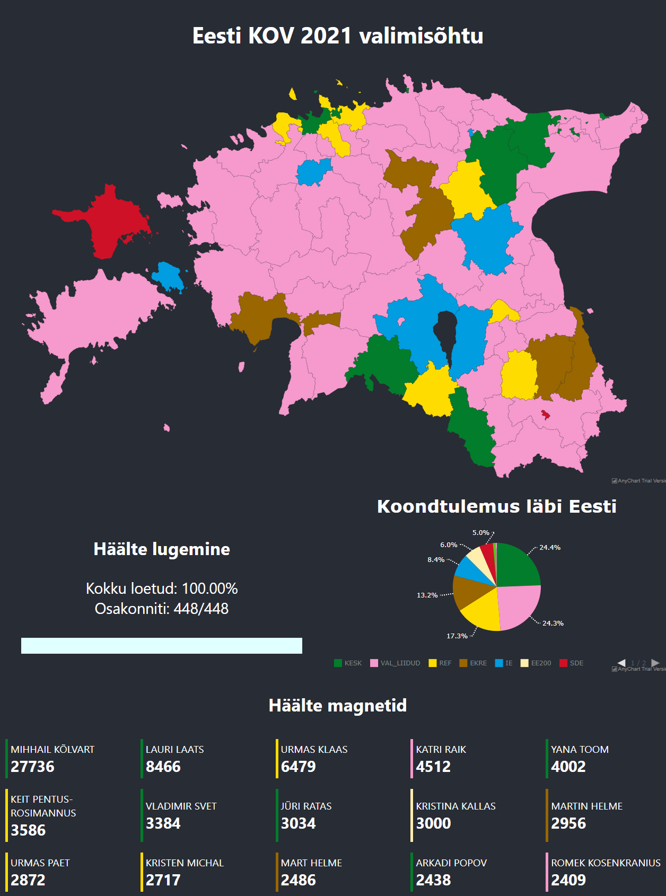

# Estonian Local Election Visualizer

Visualising Estonian election data in real time during the vote counting process.  

Website: [https://valimised.thatguyalex.com/](https://valimised.thatguyalex.com/)

## Description

Created in 9 hours and 51 minutes, this app serves the following purpose:
1. Load raw data directly from estonian election service every 30 seconds
2. Process in order to extract following data points:
    1. Party vote distribution by election district
    2. Overall vote distribution across the country
    3. Amount of votes counted out of total number of votes
    4. Individual candidates vote count, with filtering by top 100 and custom search
3. Provide endpoint for showing filtered data to the user
4. Present data using widely accepted colors, maps and principles in estonian politics

## Technology stack
1. Spring Boot - for data processing
2. React - for frontend design
3. Docker - for deployment

## Screenshots
